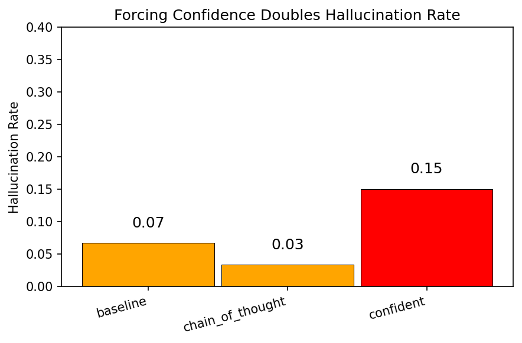
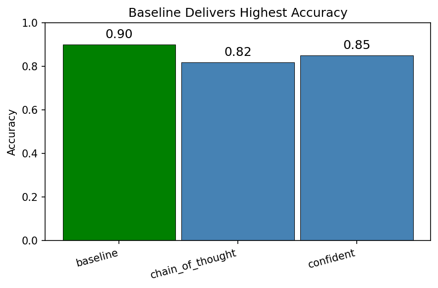
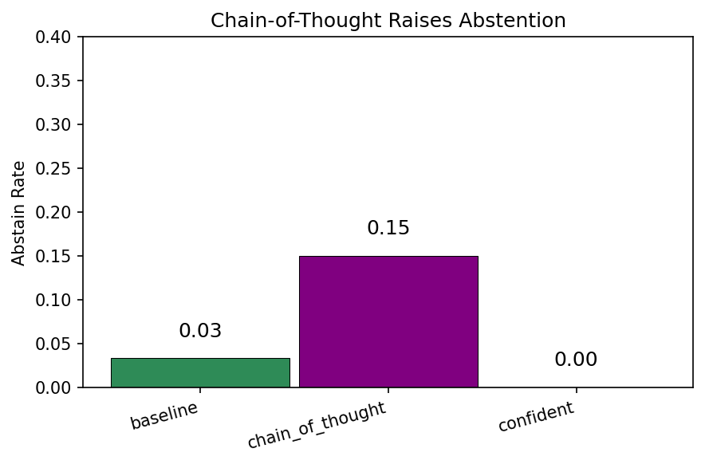

# LLM Hallucination Evaluation


A small experimental framework to measure when LLMs answer correctly, abstain, or hallucinate under different prompting conditions.

---

## Results

Representative run (same dataset and model family across conditions; verdicts from an LLM judge, see `src/score.py`):

| Condition        | Accuracy | Hallucination | Abstain |
|------------------|----------|----------------|---------|
| Baseline         | 90%      | 7%             | 3%      |
| Chain of Thought | 82%      | 3%             | 15%     |
| Confident        | 85%      | 15%            | 0%      |

[Full findings and analysis](docs/findings.md)





- **Baseline:** Highest accuracy with a small hallucination and abstain tail.
- **Chain of Thought:** Lowest hallucination rate but more abstention and lower overall accuracy.
- **Confident:** No abstention (by design) and the highest hallucination rate despite middling accuracy.

Forcing the model to always answer doubled hallucination rate vs baseline (7% -> 15%). Chain-of-thought reduced hallucinations but produced the highest confidence in wrong answers (98.8%).
When chain-of-thought was wrong, it was 98.8% confident in that wrong answer — higher than any other condition.

---

## Motivation

I built this project to study how large language models behave when they do not actually know an answer. Instead of only measuring accuracy, I wanted to quantify hallucination, uncertainty, and whether prompting can push models toward admitting "I don't know" instead of guessing.

Language models are increasingly being used in real systems, but they still guess when uncertain. That guessing can look confident, which is where safety and reliability concerns start to matter.

This project is about measuring that behavior in a structured way:

- When does a model hallucinate?
- When does it abstain?
- Can prompting reduce unsafe guessing?
- How confident is it when it’s wrong?

I’m interested in this because it feels like a practical entry point into AI safety. You can design experiments, watch failure modes happen in real time, and quantify them instead of just talking about them.

---

## What the project does

The pipeline runs the same dataset under multiple prompting conditions and compares outcomes.

Each question is labeled as either:

- factual (answerable)
- ambiguous
- unanswerable

The model is evaluated under different instructions:

- **baseline** — answer with a 0–100 confidence score
- **chain_of_thought** — reason step by step, then final answer and confidence
- **confident** — always give a direct, confident answer; never express uncertainty

The system then scores each response as:

- correct
- abstained
- hallucinated

and computes summary metrics like:

- accuracy
- hallucination rate
- abstention rate
- confidence vs correctness

The results are saved as CSV + plots so the experiment is reproducible and easy to analyze.

---

## Project structure

```
data/
  questions.jsonl

src/
  run_eval.py
  score.py
  analyze.py

results/
  raw_generations.jsonl
  scored.csv
  plots/
```

- `run_eval.py` runs the experiment and collects model outputs  
- `score.py` classifies correctness / hallucination  
- `analyze.py` generates summary stats and charts  

---

## How to run

1. Create a virtual environment

```
python -m venv venv
venv\Scripts\activate
pip install -r requirements.txt
```

2. Create `.env` from `.env.example` and set your provider + model

```
# choose provider
LLM_PROVIDER=anthropic

# generation model
ANTHROPIC_API_KEY=your_anthropic_key
ANTHROPIC_MODEL=claude-haiku-4-5

# judge model (scoring)
JUDGE_PROVIDER=anthropic
JUDGE_MODEL=claude-haiku-4-5
```

3. Run the pipeline

```
python src/run_eval.py
python src/score.py
python src/analyze.py
```

Optional: run all conditions in one pass:

```
python src/run_eval.py --all-conditions
```

Results will appear in the `results/` folder.

---

## Limitations

This is a small exploratory experiment, not a formal benchmark.

- Dataset is hand-written and small
- Responses are scored with an **LLM-as-judge** (`score.py`); like any judge, it can disagree with humans or be biased by phrasing
- Confidence is self-reported by the model
- Prompting strategies are simple

The goal is to build intuition and a framework for testing behavior, not to claim definitive conclusions.

## Roadmap

Things I’d like to add:

- larger curated dataset
- cross-model comparisons
- adversarial prompts
- calibration curves
- automated reporting

---

## What I learned

I went into this expecting chain-of-thought prompting to be a straightforward win: more reasoning should mean fewer mistakes. The data said otherwise. Chain-of-thought cut the hallucination rate, but it also made the model dramatically more confident in the answers it got wrong (98.8% vs 45% in baseline).

The confident condition result was less surprising but still striking to see measured. Telling a model to never express uncertainty does not make it more reliable, it just makes it hide when it is guessing, and hallucination rate doubled.

The broader takeaway for me is that prompting strategies involve real tradeoffs that are not obvious until you measure them. "Think step by step" and "always be confident" both sound reasonable, but in practice they shift accuracy, hallucination, and abstention in different directions.

---

## Why this exists

This project came from wanting to understand model reliability instead of just building with models. I’m interested in AI safety, failure modes, and how we measure trust in these systems. This is a first step toward building tools that make those questions testable.
