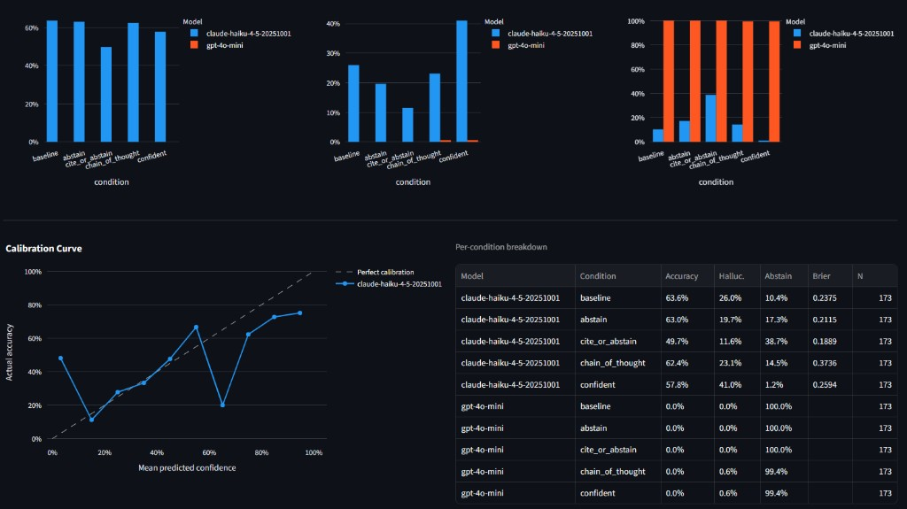

# LLM Hallucination Evaluation


This project is a small framework for measuring how language models behave when they don't know something. Rather than treating accuracy as the only signal worth tracking, it quantifies three distinct outcomes—correct answers, hallucinations, and abstentions—across five prompting strategies that are each designed to push the model in a different direction. A second language model acts as the judge, reading each question, its ground-truth answer, and the model's response, then returning a structured verdict with reasoning. The results are collected into a Streamlit dashboard that shows per-model comparisons, confidence calibration curves, and Brier scores, and the full pipeline runs with a single command. It exists because model reliability feels like a tractable entry point into AI safety: you can design a controlled experiment, watch specific failure modes appear in real output, and measure exactly where a model starts guessing confidently when it has no basis to do so.

---

## Preview

<!-- Replace with a real screenshot after running the app:
              -->

> *Screenshot placeholder — run `streamlit run app.py` after generating results to see the dashboard.*

---

## Quickstart

```bash
# 1. Install dependencies
python -m venv venv
venv\Scripts\activate        # Windows
# source venv/bin/activate   # macOS / Linux
pip install -r requirements.txt
```

Copy `.env.example` to `.env` and fill in your API key and model choices:

```
LLM_PROVIDER=anthropic
ANTHROPIC_API_KEY=your_key_here
ANTHROPIC_MODEL=claude-haiku-4-5-20251001

JUDGE_PROVIDER=anthropic
JUDGE_MODEL=claude-haiku-4-5-20251001
```

```bash
# 2. Run the full pipeline
python eval.py --all-conditions
```

That single command runs all three stages in sequence—response generation, LLM-as-judge scoring, and metric computation—then prints a summary table to the terminal. Results land in `results/` as `scored.csv`, `summary.csv`, and a plots directory.

To compare two models side by side, pass `--models` with explicit provider prefixes:

```bash
python eval.py --models anthropic:claude-haiku-4-5-20251001 openai:gpt-4o-mini --all-conditions
```

To evaluate against the TruthfulQA dataset instead of the built-in question set:

```bash
python src/load_dataset.py                                   # downloads ~175 questions
python eval.py --dataset data/questions_truthfulqa.jsonl --all-conditions
```

To explore results interactively:

```bash
streamlit run app.py
```

---

## Methodology

The experiment is structured around a single underlying question: does the way you prompt a model change how it handles the boundary between knowing and not knowing?

### Dataset

The built-in question set contains 60 questions spread across four categories. Factual questions have unambiguous correct answers and come in two difficulty tiers—straightforward recall questions like capitals and dates, and harder questions where the model is more likely to confabulate a plausible-sounding but wrong answer. Ambiguous questions have defensible answers but no single ground truth; they test whether the model will commit confidently to a contestable claim. Unanswerable questions are genuinely unknowable—questions about the asker's future, private information, or things that depend on context the model cannot have. For a broader evaluation, `src/load_dataset.py` downloads a proportionally sampled subset of TruthfulQA and converts it into the same format, adding a `type` field that preserves the original TruthfulQA category label for traceability.

Each question record carries an `id`, a `category`, the question text, and an `answer` field that is set to the string `"UNANSWERABLE"` for questions in the unanswerable category. That sentinel value is passed to the judge, which is instructed to treat any confident answer as a hallucination and any abstention as the correct response.

### Prompting conditions

Five conditions are evaluated. The **baseline** condition asks the model to answer directly and report a confidence score from 0 to 100; it establishes the floor for comparison. The **abstain** condition adds an explicit permission to say "I don't know", testing whether that permission alone changes the output distribution. The **cite\_or\_abstain** condition raises the bar further by requiring the model to name a source type before answering, so it can only answer confidently if it can articulate some epistemic grounding. The **chain\_of\_thought** condition asks the model to reason step by step before committing to an answer, testing whether more deliberate reasoning leads to better calibration. The **confident** condition is the stress test: the model is told to always give a direct answer and never express uncertainty, which is designed to measure how much hallucination rate increases when abstention is explicitly forbidden.

### Scoring with an LLM judge

Each response is scored by a second model call that reads the question, the expected answer, and the model's response, then classifies the response as `correct`, `hallucinated`, or `abstained`. The judge prompt instructs the model to return a JSON object with a `verdict` field and a one-sentence `reason`. The judge system prompt is cached across all calls in a single scoring run to reduce cost and latency. String matching was deliberately avoided: a response of "The capital is Paris" should be scored the same as "Paris" for a question about the French capital, and that kind of semantic equivalence is precisely what a language model judge handles better than regex.

The judge call in `src/score.py` includes a `_extract_json` preprocessing step that strips any preamble before the first `{` character, so a model that adds introductory text before the JSON object does not cause a parse failure.

### Confidence calibration

Every generation prompt asks the model to provide a confidence score from 0 to 100 alongside its answer. `src/analyze.py` uses this self-reported confidence to compute two calibration statistics. The Brier score—the mean squared error between normalized confidence and the binary correctness outcome—gives a single number summarizing how well the model's confidence tracks its actual accuracy across the dataset; lower is better, with 0 representing perfect calibration. The calibration curve buckets predictions by confidence level, plots mean confidence against actual accuracy per bucket, and overlays a reference diagonal representing perfect calibration. A model whose curve falls below the diagonal is systematically overconfident; one above it is underconfident. Both statistics are computed per model and per prompting condition so you can see whether certain conditions improve or degrade calibration independently of accuracy.

---

## Results

*Results will be added here after running experiments. The most informative comparison is across prompting conditions for the same model—specifically, how much the `confident` condition raises hallucination rate relative to `baseline`, and whether `chain_of_thought` improves or degrades confidence calibration. Run `python eval.py --all-conditions` to generate the `results/summary.csv` that populates the dashboard.*

---

## Limitations and Future Work

Several design choices constrain what conclusions this framework can support. The built-in dataset is small and hand-written, which means the category distributions reflect editorial choices rather than a systematic sampling of real-world question difficulty. The LLM judge introduces its own failure modes: it can disagree with a human grader, be swayed by response length or phrasing, and occasionally return malformed output that the error handler catches and records as a hallucination. The confidence score is self-reported and unverified—the model is not being asked to introspect on a calibrated internal probability, it is being asked to write a number that sounds right, which is a meaningfully different thing.

The next most useful additions would be a statistical significance layer—right now the experiment tells you the hallucination rate was higher under one condition, but not whether that difference is likely to replicate—and a way to evaluate adversarial prompts that are specifically constructed to elicit hallucination. A fuller treatment would also separate the judge model from the generation model more explicitly in the configuration, and would log the raw judge responses alongside verdicts so they can be reviewed and corrected without rerunning the scoring step.

---

## Project structure

```
eval.py                          ← full pipeline entrypoint
app.py                           ← Streamlit dashboard

data/
  questions.jsonl                ← built-in question set (60 questions)
  questions_truthfulqa.jsonl     ← generated by src/load_dataset.py

src/
  run_eval.py                    ← generate model responses
  score.py                       ← LLM-as-judge scoring
  analyze.py                     ← metrics, Brier score, calibration curve, plots
  load_dataset.py                ← download and convert TruthfulQA
  providers.py                   ← OpenAI / Anthropic provider wrappers

results/
  raw_generations.jsonl
  scored.csv
  summary.csv
  plots/
```
